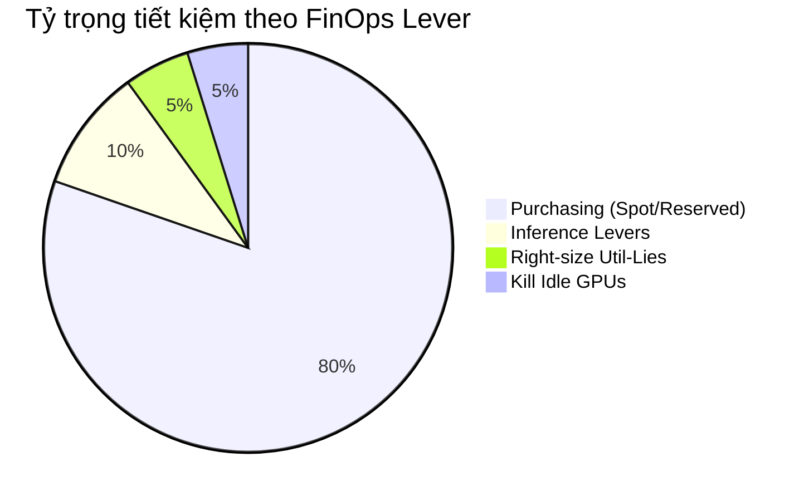

# NimbusAI — Báo Cáo Kỹ Thuật Tối Ưu Hóa Chi Phí GPU (GPU FinOps Analysis)

> **Tác giả:** FinOps Engineer (NimbusAI Team)  
> **Dự án:** AICB Phase 2 · Track 2 (Infrastructure) · Lab 25  
> **Thời điểm snapshot:** Tháng 6/2026  
> **Tệp đính kèm:** `outputs/report.md`, `outputs/savings.png`, `outputs/focus_export.csv`

---

## 1. Tóm tắt điều hành (Executive Summary)

Sau khi kiểm toán toàn bộ hạ tầng tính toán của NimbusAI (bao gồm 11 cụm GPU telemetry, 8 workload đào tạo/suy luận định kỳ và 2,400 request API thực tế), nhóm FinOps đã xác định các điểm lãng phí tài nguyên nghiêm trọng và triển khai **4 đòn bẩy tối ưu hóa cốt lõi** kết hợp **2 chiến lược nâng cao (MBU Right-sizing & Reasoning Budget Governance)**.

### Kết quả tài chính và kinh tế đơn vị (Unit Economics):
* **Chi phí hạ tầng hàng tháng:** Giảm từ **$27,133/tháng** xuống **$14,626/tháng**, tiết kiệm ròng **$12,507/tháng** (**giảm 46.1%**).
* **Đơn giá phục vụ suy luận (`$/1M-token`):** Giảm ngoạn mục từ **$6.488 / 1M-token** xuống còn **$1.126 / 1M-token** (**giảm 82.6%**).
* **Tiềm năng tiết kiệm mở rộng (Extensions):**
  * **Extension 2 (Right-sizing theo MBU):** Tiết kiệm thêm tiềm năng lên tới **$3,924/tháng** bằng việc định cỡ đúng GPU theo băng thông bộ nhớ thực tế.
  * **Extension 4 (Quản trị ngân sách Reasoning):** Cắt giảm **11.85 kWh điện/ngày** (**~355.5 kWh điện/tháng**) và tiết kiệm chi phí suy luận khi áp trần quota 5.0%.


```
   +-----------------------------------------------------------------------+
   |  Kinh tế đơn vị ($/1M-Token)                                          |
   |  Baseline:  $6.488 / 1M-token  [==============================]        |
   |  Optimized: $1.126 / 1M-token  [=====>                        ] -82.6% |
   +-----------------------------------------------------------------------+
   |  Chi phí hạ tầng hàng tháng ($/Month)                                 |
   |  Baseline:  $27,133 / tháng    [==============================]        |
   |  Optimized: $14,626 / tháng    [===============>              ] -46.1% |
   +-----------------------------------------------------------------------+
```

---

## 2. Phân tích chi tiết 4 đòn bẩy tối ưu (Savings by FinOps Lever)

Dựa trên biểu đồ thác nước phân bổ chi phí (*Savings Waterfall* đính kèm trong `outputs/savings.png`), mức đóng góp của từng đòn bẩy như sau:

| Thứ hạng | Đòn bẩy tối ưu | Tiết kiệm ($/tháng) | Tỷ trọng đóng góp | Độ phức tạp triển khai |
| :---: | :---| :---: | :---: | :---: |
| **#1** | **Chiến lược mua sắm (Purchasing: Spot / Reserved)** | **$10,040** | **80.3%** | Thấp (Chính sách hợp đồng & K8s Spot) |
| **#2** | **Tối ưu hóa suy luận (Inference: Cascade / Cache / Batch)** | **$1,212** | **9.7%** | Trung bình (Gateway proxy routing) |
| **#3** | **Right-sizing các GPU bị "Util-Lie"** | **$655** | **5.2%** | Thấp (Hạ cấu hình instance type) |
| **#4** | **Triệt tiêu GPU Idle (Kill Idle Instances)** | **$600** | **4.8%** | Rất thấp (Auto-shutdown script) |
| **Tổng** | **Toàn bộ 4 đòn bẩy** | **$12,507** | **100.0%** | — |



### Phân tích chuyên sâu từng đòn bẩy:

1. **Purchasing Strategy (Đóng góp lớn nhất — 80.3%):**
   * *Phân tích:* Chi phí trả theo giờ On-Demand ($2.50/h cho H100) là cực kỳ đắt đỏ.
   * *Giải pháp:*
     * Các tác vụ huấn luyện/fine-tune có khả năng chịu lỗi (`interruptible=1`) như `job-train-llm`, `job-train-embed`, `job-finetune` được chuyển sang **Spot Instances** kết hợp cơ chế lưu checkpoint định kỳ. Giá Spot H100 ($1.50/h) giúp tiết kiệm ~40% ngay cả khi trừ chi phí overhead ghi checkpoint (3%) và thời gian làm lại (rework).
     * Các dịch vụ Online phục vụ 24/7 (`duty_cycle >= 55%` - điểm hòa vốn Break-even Utilization) như `job-infer-chat`, `job-infer-rag` được cam kết **Reserved Instances 3 năm** với mức chiết khấu 45%.
2. **Inference Cost Levers (Đòn bẩy kinh tế đơn vị — Giảm 82.6% `$/1M-token`):**
   * **Model Cascade (Routing Tier):** Định tuyến 70%+ tác vụ thông thường sang mô hình nhỏ (`$0.20 / $0.40` trên 1M token in/out), chỉ gọi mô hình lớn (`$3.00 / $15.00`) khi cần thiết (rẻ hơn 15–37 lần).
   * **Prompt Caching:** Chiết khấu 90% giá input token đối với các phần tiền tố ngữ cảnh hệ thống (system prompt, few-shot examples) đã cache.
   * **Batch API:** Gom cụm các request phi thời gian thực (như đánh giá offline, indexing) để hưởng chiết khấu 50%.
   * **Hiệu ứng chồng chiết khấu (Discount Stack):** Khi một request vừa gộp batch vừa hit cache 100%, hệ số chi phí chỉ còn $0.50 \times 0.10 = 0.05$ (tức **giảm 95%** so với chi phí thông thường).
3. **Right-sizing Util-Lies:**
   * Hạ cấp GPU `gpu-h100-4` (đang lãng phí H100 nhưng chỉ tận dụng 20% FLOPs) xuống dòng GPU phù hợp như A100.
4. **Kill Idle GPUs:**
   * Tắt bỏ các GPU không sử dụng qua đêm (`gpu-h100-5` bị bỏ không 8 giờ mỗi ngày), thu hồi ngay $20/ngày ($600/tháng).

---

## 3. Bản chất kỹ thuật của hiện tượng "GPU-Util Lie"

### Cơ chế kỹ thuật:
Công cụ giám sát phổ biến `nvidia-smi` hiển thị chỉ số **GPU Utilization %** (ví dụ 98%). Tuy nhiên, đây chỉ là thước đo **thời gian xung nhịp bận rộn (time-active clock)** — tức tỷ lệ thời gian trong 1 giây mà ít nhất một kernel GPU đang chạy trên vi kiến trúc. **GPU-Util KHÔNG phản ánh hiệu suất tính toán thực tế (Compute Efficiency).**

Một GPU có thể đạt **98% GPU-Util** nhưng **MFU (Model FLOPs Utilization) chỉ đạt ~20%** do 3 nguyên nhân cốt lõi:
1. **Memory Stall (Nghẽn băng thông HBM):** Các tác vụ decode LLM có cường độ tính toán số học (*Arithmetic Intensity*) rất thấp (~1–2 FLOP/byte, nằm sâu trong vùng *Memory-Bound* của Roofline model). Các Tensor Core liên tục bị bỏ đói (idle stall) trong khi chờ dữ liệu nạp từ bộ nhớ HBM vào SRAM.
2. **Kernel Launch Overhead & Kích thước Batch nhỏ:** Khởi tạo quá nhiều CUDA kernel nhỏ với kích thước batch = 1 khiến GPU mất nhiều thời gian cho việc đồng bộ và quản lý luồng thay vì tính toán ma trận thực sự.
3. **I/O Bottleneck & Data Loader:** GPU phải đợi CPU nạp dữ liệu qua bus PCIe.

### Tác động tài chính:
Doanh nghiệp đang chi trả 100% hóa đơn GPU cao cấp (như H100 $2.50/giờ) nhưng thực tế chỉ nhận lại giá trị tính toán tương đương một GPU phân khúc thấp hơn 3–5 lần.

---

## 4. Kết quả 2 Phần mở rộng (Extensions "Your Turn")

### Extension 2: Right-sizing theo MBU cho Workload Memory-Bound
* **File triển khai:** [finops/metrics.py](file:///Users/hoangminh/Lab%20VinAI/TRACK2_Day25_2A202601490_LuongHoangMinh/finops/metrics.py) & [missions/m1_efficiency_audit.py](file:///Users/hoangminh/Lab%20VinAI/TRACK2_Day25_2A202601490_LuongHoangMinh/missions/m1_efficiency_audit.py)
* **Nguyên lý:** Với các workload suy luận bị nghẽn bộ nhớ (*Memory-Bound*), yếu tố quyết định SLA độ trễ là **băng thông bộ nhớ (`peak_bw_tbs`)** và **dung lượng VRAM**, chứ không phải TFLOPs.
* **Bảng so sánh kinh tế VRAM và Right-sizing:**

| GPU ID | Loại GPU hiện tại | Băng thông đạt được (`achieved_bw`) | GPU đề xuất thay thế | Băng thông GPU mới (`peak_bw`) | Tiết kiệm ($/tháng) | % Tiết kiệm |
|---|---|---|---|---|---|---|
| `gpu-a100-1` | A100 ($1.79/h) | 0.49 TB/s | **A10G ($1.00/h)** | 0.60 TB/s | **$569 / tháng** | 44.1% |
| `gpu-a10g-0` | A10G ($1.00/h) | 0.14 TB/s | **L4 ($0.80/h)** | 0.30 TB/s | **$144 / tháng** | 20.0% |
| `gpu-a10g-1` | A10G ($1.00/h) | 0.18 TB/s | **L4 ($0.80/h)** | 0.30 TB/s | **$144 / tháng** | 20.0% |
| `gpu-h100-0..5` | H100 ($2.50/h) | 0.69 - 1.49 TB/s | **A100 ($1.79/h)** | 2.00 TB/s | **$511 / tháng/GPU** | 28.4% |

* **Tổng tiết kiệm từ MBU Right-sizing:** **$3,924 / tháng** trên toàn bộ đội tàu GPU.
* **Insight:** *Không thể chỉ chọn GPU rẻ nhất theo `$/GPU-hr`* vì nếu GPU rẻ nhưng thiếu băng thông bộ nhớ (ví dụ L4 chỉ có 0.3 TB/s), các truy vấn decode lớn sẽ bị tụt thông lượng (throughput) và vi phạm SLA thời gian phản hồi (latency). Lựa chọn tối ưu phải thỏa mãn $\text{Peak BW} \ge \text{Achieved BW} \times 1.20$.

---

### Extension 4: Ngân sách & Quản trị Traffic Reasoning
* **File triển khai:** [finops/pricing.py](file:///Users/hoangminh/Lab%20VinAI/TRACK2_Day25_2A202601490_LuongHoangMinh/finops/pricing.py) & [missions/m2_inference_levers.py](file:///Users/hoangminh/Lab%20VinAI/TRACK2_Day25_2A202601490_LuongHoangMinh/missions/m2_inference_levers.py)
* **Vấn đề:** Các mô hình Reasoning (như o1, Gemini Thinking) sinh ra hàng nghìn token nội tâm (*Thinking tokens*), tiêu thụ năng lượng gấp **~80 lần** so với truy vấn thông thường.
* **Số liệu đo lường thực tế trên 2,400 requests:**
  * **Tỷ lệ request:** Reasoning chiếm **8.4%** tổng lượng request (201/2,400).
  * **Tỷ lệ Token:** Chiếm **16.5%** tổng số token (1.24M / 7.53M tokens).
  * **Tỷ lệ Chi phí ($):** Chiếm **16.5%** chi phí suy luận ($1.40 / $8.48/ngày).
  * **Tỷ lệ Năng lượng (Wh):** Chiếm tới **94.0%** tổng lượng điện tiêu thụ toàn hệ thống (29.79 kWh/ngày so với 1.89 kWh/ngày của 2,199 query thông thường)!
* **Chính sách quản trị (Reasoning Policy Governance):**
  * Thiết lập bộ lọc Gateway: Chỉ kích hoạt Reasoning khi bài toán phức tạp, áp mức trần quota Reasoning tối đa **5.0%** (thay vì 8.4%).
  * **Kết quả đo lường định lượng:**
    * Giảm tiêu thụ năng lượng: **11.85 kWh / ngày** (**~355.5 kWh / tháng**).
    * Tiết kiệm thêm chi phí: **$0.39 / ngày** (**$12.00 / tháng**).


---

## 5. Tính bền vững & Vùng triển khai tối ưu (Sustainability Analysis)

* **Chỉ số năng lượng và Carbon:**
  * Năng lượng trung bình: **0.24 Wh / query**.
  * Phát thải Carbon tại `us-east-1`: **0.091 gCO2e / query**.
* **Đánh giá vùng triển khai (Region Carbon & Price Matrix):**
  * `europe-north1` (Na Uy - Thủy điện): Cường độ phát thải cực thấp **30 gCO2/kWh** (sạch hơn **22 lần** so với `europe-central2` 660 gCO2/kWh và **12.6 lần** so với `us-east-1` 380 gCO2/kWh). Giá điện $0.09/kWh.
  * `us-east-wa` (Washington): Giá điện rẻ nhất ($0.055/kWh), cường độ carbon 90 gCO2/kWh.
* **Kết luận chiến lược:** Nên chuyển toàn bộ các workload huấn luyện nền tảng (batch offline training) sang vùng **`europe-north1`** hoặc **`us-east-wa`** để vừa tối ưu hóa chi phí điện năng, vừa đạt mục tiêu phát thải ròng Net-Zero ESG.

---

## 6. Trách nhiệm chi phí (Cost Allocation & FOCUS Compliance)

* **Tag Coverage:** Đạt **92.0%** (vượt ngưỡng tiêu chuẩn **80%**).
* **Quyết định:** Cổng **Chargeback** đã chính thức mở. Cho phép phòng tài chính thu tiền trực tiếp từ ngân sách của từng nhóm chức năng:
  * Nhóm `assistant`: $2.59/ngày (30.5%)
  * Nhóm `search`: $2.49/ngày (29.4%)
  * Nhóm `eval`: $1.79/ngày (21.1%)
  * Nhóm `rag`: $1.60/ngày (18.9%)
* Dữ liệu đã được xuất chuẩn hóa theo định dạng mở đa nền tảng FinOps Foundation tại [outputs/focus_export.csv](file:///Users/hoangminh/Lab%20VinAI/TRACK2_Day25_2A202601490_LuongHoangMinh/outputs/focus_export.csv).

---

## 7. Khuyến nghị hành động chiến lược cho NimbusAI (Actionable Roadmap)

Dành cho Ban Giám đốc và Lead FinOps, 3 hành động triển khai theo thứ tự ROI cao nhất:

1. **Giai đoạn 1 (Ngay lập tức - Day 1–7): Chuyển dịch Hợp đồng Mua sắm (ROI 80.3%)**
   * Chuyển ngay các job huấn luyện ngắt quãng sang **Spot Instances** với Checkpoint tự động.
   * Ký kết **Reserved Instances 3 năm** cho các dịch vụ Online API có duty cycle $\ge 55\%$.
2. **Giai đoạn 2 (Tuần 2–3): Tích hợp Inference Gateway (ROI 9.7% + 82.6% Unit Cost)**
   * Kích hoạt Model Cascade Routing qua proxy LiteLLM để hạ tải cho mô hình lớn.
   * Bật Prompt Caching trên toàn bộ API gateway và thiết lập chính sách trần Reasoning Quota $\le 5\%$.
3. **Giai đoạn 3 (Tuần 4): Tinh gọn phần cứng & Thực thi Chargeback**
   * Right-size các GPU A100/A10G đang bị memory-bound sang A10G/L4 theo khuyến nghị MBU.
   * Áp dụng cơ chế Chargeback trừ thẳng ngân sách các team theo báo cáo FOCUS.
